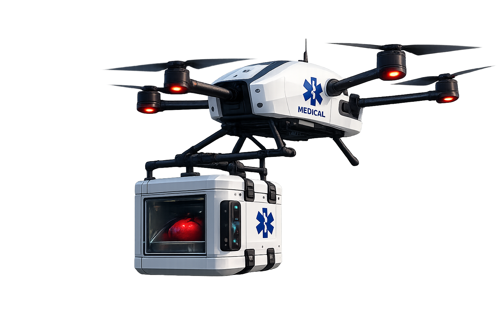

# 🚁 Projet GI2 — Livraison des organes par drones

## 📌 Contexte
Dans le domaine médical, le temps est un facteur critique lors des transplantations d’organes.  
Ce projet propose une solution innovante basée sur l’utilisation de **drones autonomes** pour assurer une livraison rapide, fiable et sécurisée entre établissements de santé.

## Interface


---

## 🎯 Problématique
Comment optimiser le transport des organes en minimisant les délais tout en garantissant :
- ⚡ la rapidité  
- 📍 la précision des trajets  
- 🔒 la sécurité  
- 🌍 une couverture efficace du territoire  

---

## 💡 Solution proposée
Nous développons un système intelligent de livraison par drones reposant sur des **algorithmes géométriques avancés**, notamment :
- 🔺 **Triangulation de Delaunay**
- 🔷 **Diagrammes de Voronoï**

Ces outils permettent d’optimiser les trajets et d’organiser efficacement l’espace de livraison.

---

## 🧠 Approche algorithmique

### 🔺 Triangulation de Delaunay
- Permet de relier les points (hôpitaux) de manière optimale
- Évite les triangles trop “aplatis”
- Sert de base pour construire un réseau de trajets efficace

### 🔷 Diagrammes de Voronoï
- Partitionnent l’espace en zones d’influence autour de chaque hôpital
- Permettent de déterminer **quel drone/hôpital est le plus proche**
- Optimisent la répartition des livraisons

👉 Ensemble, ces deux structures permettent :
- une meilleure planification des trajets  
- une réduction des distances parcourues  
- une optimisation globale du système  

---

## 🧭 Fonctionnalités prévues

- Ajouter, supprimer et déplacer des bases de drones
- Ajouter, supprimer et déplacer des demandes médicales
- Associer chaque demande au drone le plus proche
- Afficher les cellules de Voronoï
- Afficher la triangulation de Delaunay
- Sélectionner une zone ou un point pour afficher ses informations
- Calculer des statistiques par zone
- Importer des points depuis un fichier
- Exporter/importer une carte complète en fichier binaire
- Proposer une version en ligne de commande
- Proposer une interface graphique JavaFX

---


## 📊 Statistiques prévues

Pour chaque zone Voronoï, l’application pourra afficher :

- nombre de demandes médicales
- distance minimale vers la base
- distance maximale vers la base
- distance moyenne
- densité de demandes
- temps estimé moyen de livraison

---

## 🛠️ Technologies utilisées

- Java
- JavaFX
- Algorithmes géométriques
- Diagramme de Voronoï
- Triangulation de Delaunay
- Sérialisation binaire
- Import/export CSV

---

## 👥 Équipe
Projet réalisé par un groupe de 4 étudiants en ING1 (CY Tech).

---


## 📅 Avancement
- [x] Définition du projet  
- [x] Analyse des besoins  
- [ ] Implémentation des algorithmes  
- [ ] Développement plateforme  
- [ ] Tests et validation  

---

## 🗂️ Organisation du code

```text
src/
 └── main/
    └── java/
        ├── app/
        ├── model/
        ├── service/
        └── ui/
 
 


---


